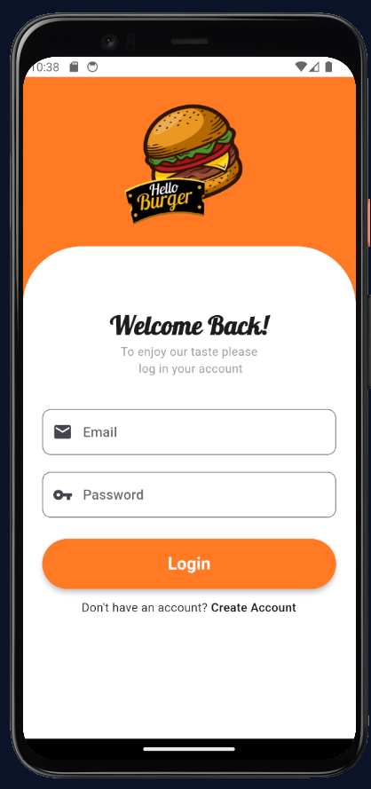
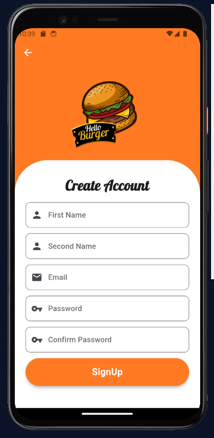
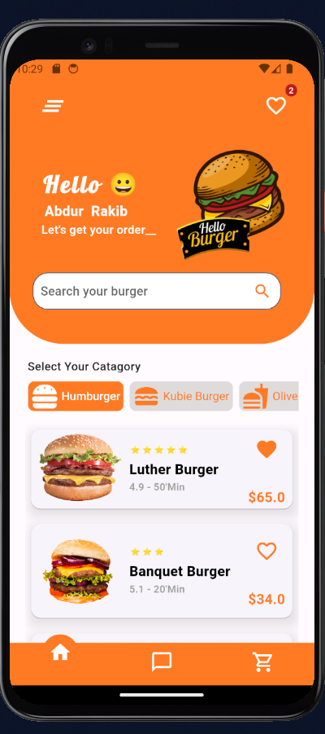
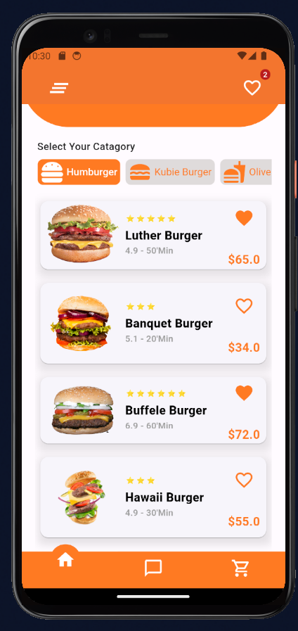

# burgerapp
You can order burger online through this application.It can be an application focusing on a resturant,where the customer will chosee as he likes various item.

## Features
* Signin Option
* Create Account
* Profile Section
* User Profile Pic Upload system
* Customers Review
* Online order based on location
* Payment option

As a back-end database it uses **Firebase**
## App Screens-

    
    
    
   

    
    
    

    
    
   

