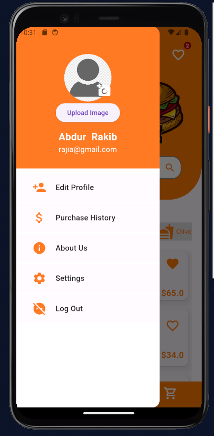
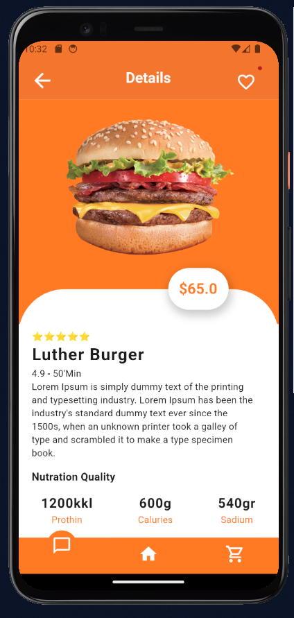
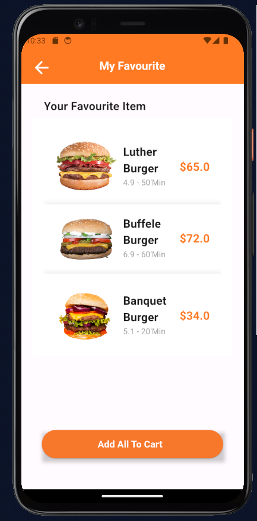
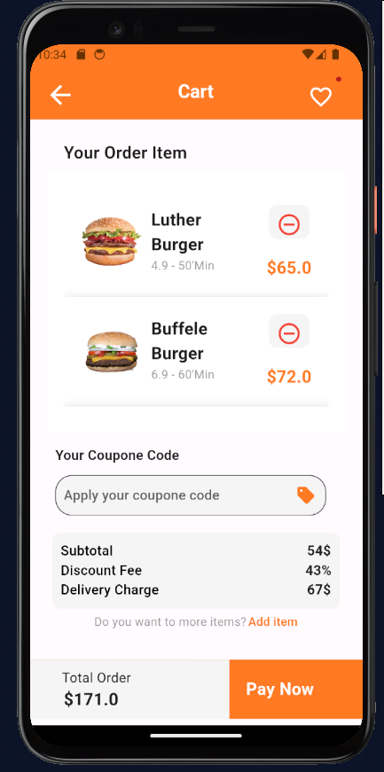
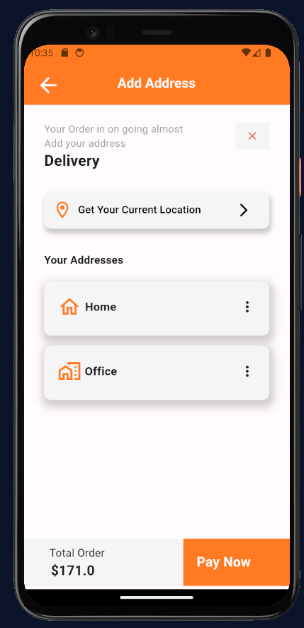
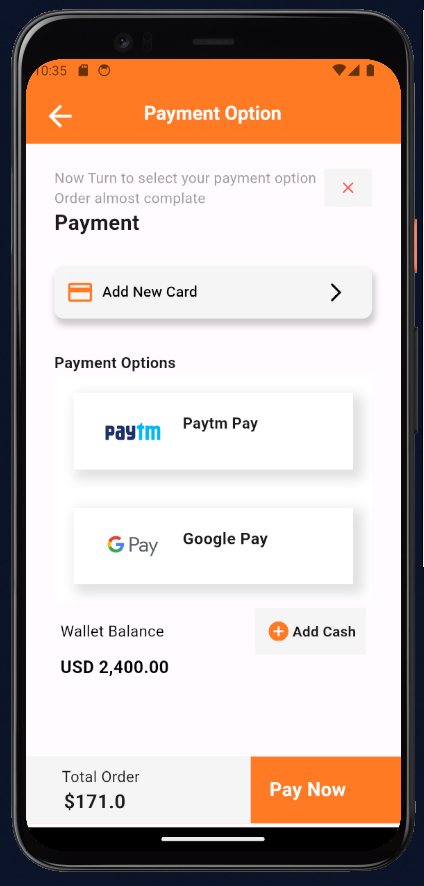
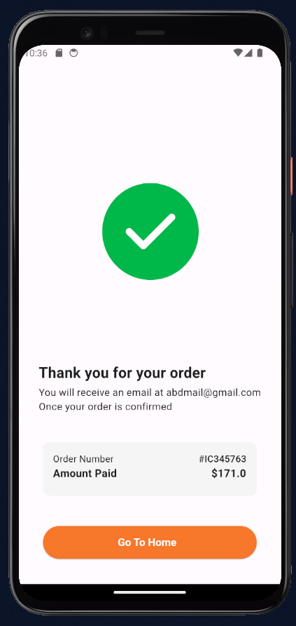
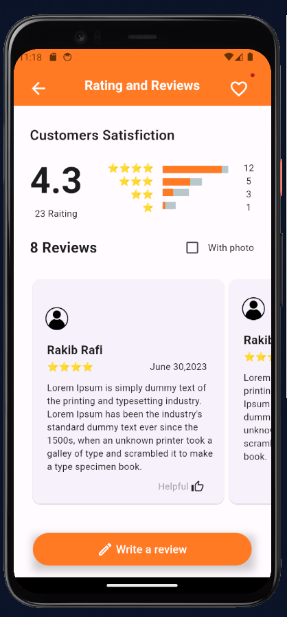
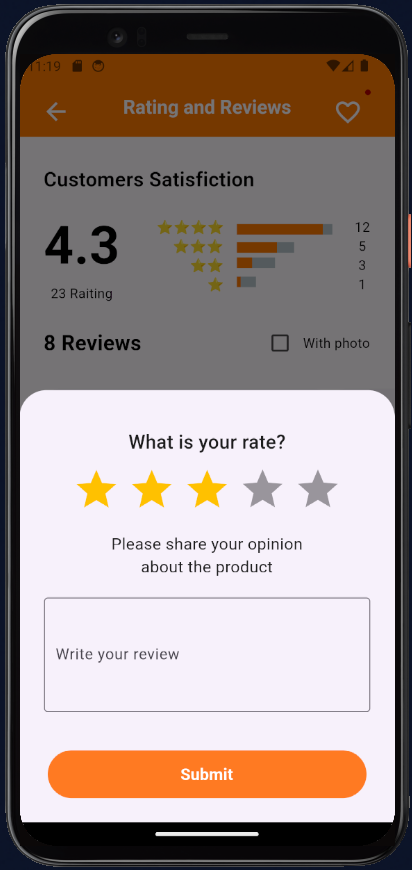

# burgerapp  :hamburger:
You can order burger online through this application.It can be an application focusing on a resturant,where the customer will chosee as he likes various item.

## Features :point_down:
* Signin Option
* Create Account
* Profile Section
* User Profile Pic Upload system
* Customers Review
* Online order based on location
* Payment option

As a back-end database it uses **Firebase**
## App Screens :information_desk_person:

    
    
    
   

    
    
    
   

    
    
    
   

    
    

